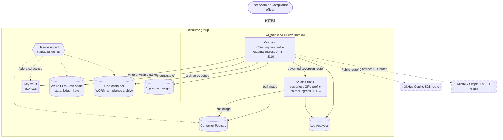
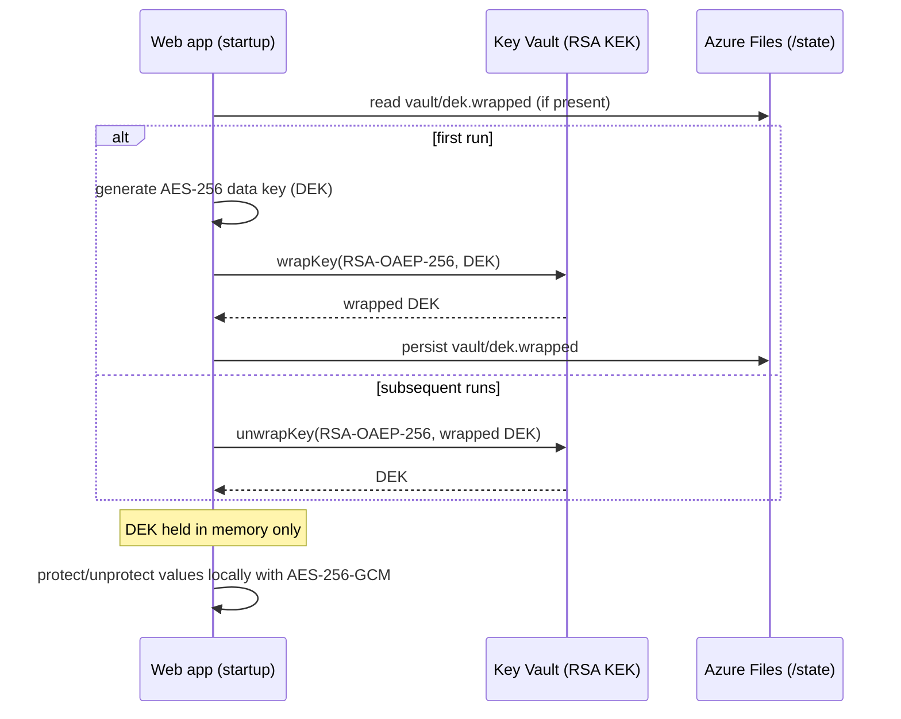

# PDA on Azure — Architecture

This document describes the Azure hosting architecture for the PDA governance demo:
the Node.js Copilot-SDK agent, its confidentiality/sovereignty governance, and its
signed append-only compliance ledger, deployed to Azure Container Apps with
Infrastructure as Code (Bicep + Azure Verified Modules).

> The original application is a Windows, loopback-only local demo. The Azure target
> keeps that local mode intact and adds a cloud mode that is enabled only through
> environment variables (see [Runtime configuration](#runtime-configuration)).

## Contents

- [Component overview](#component-overview)
- [Topology diagram](#topology-diagram)
- [Request and inference flow](#request-and-inference-flow)
- [Data at rest and encryption](#data-at-rest-and-encryption)
- [Identity and access](#identity-and-access)
- [Networking and ingress](#networking-and-ingress)
- [Azure Verified Modules used](#azure-verified-modules-used)
- [Runtime configuration](#runtime-configuration)
- [Design decisions and honest limitations](#design-decisions-and-honest-limitations)

## Component overview

| Component | Azure service | Purpose |
| --- | --- | --- |
| Web app (governance agent) | Azure Container Apps (Consumption profile) | Serves the chat/Admin/Compliance UI and the governed agent loop |
| Sovereign model route | Azure Container Apps (serverless GPU profile) | Runs Ollama for the on-premises / highly confidential route, internal ingress only |
| At-rest key material | Azure Key Vault | RSA key-encryption key (KEK) that wraps the app data-encryption key |
| Live state | Azure Storage — Azure Files (SMB) | Persists signing key, ledger, checkpoint and secrets across revisions |
| Compliance archive | Azure Storage — Blob with time-based WORM | Immutable, append-friendly home for exported compliance evidence |
| Container image | Azure Container Registry | Stores the web image; pulled with managed identity |
| Workload identity | User-assigned managed identity | Key Vault, ACR and Storage access without secrets |
| Telemetry | Log Analytics + Application Insights | Console logs, metrics and traces |

## Topology diagram

`*` The Public → Copilot route requires an interactive Copilot CLI sign-in that is not
available inside Container Apps. See [limitations](#design-decisions-and-honest-limitations).

## Request and inference flow

1. A browser request reaches the **web app** over HTTPS via the Container Apps external
   ingress (TLS terminates at ingress; traffic forwards to container port `8110`).
2. The server validates the `Host` header against its allow-list and enforces
   same-origin for state-changing calls, then runs the governed agent turn.
3. For non-Copilot routes the SDK is pointed at an **in-process proxy**
   (`/internal/model/<token>/v1`) on the same container, which performs the actual,
   policy-checked egress:
   - **Sovereign / highly confidential** → the internal **Ollama** app over the
     environment's internal ingress.
   - **EU** → Mistral or SimpleLLM (declared EU endpoints; location is a provider
     declaration, not attested execution).
4. Every authorization, egress, fallback and tool decision is appended to the signed
   ledger on the Azure Files mount.

## Data at rest and encryption

The original app encrypts secrets and the Ed25519 signing key with **Windows DPAPI**,
which is unavailable on Linux. The Azure build replaces DPAPI with **envelope
encryption backed by Key Vault**, implemented in `app/protector.mjs`:

- Only the one-time wrap/unwrap of the data key touches Key Vault; per-value
  `protect`/`unprotect` stay local and synchronous, preserving the storage layer's
  synchronous contract.
- The **compliance archive** blob container has a **time-based immutability (WORM)**
  policy with protected append writes, so exported evidence cannot be overwritten or
  deleted within the retention window. This is a genuine storage-level guarantee,
  stronger than the application hash chain alone.
- Blob **versioning**, **change feed** and **soft-delete** are enabled for recovery.

## Identity and access

A single **user-assigned managed identity** is attached to both container apps.
Role assignments (provisioned via AVM `roleAssignments`):

| Target | Role | Why |
| --- | --- | --- |
| Key Vault | Key Vault Crypto User | wrap/unwrap the data-encryption key |
| Key Vault | Key Vault Secrets User | read any future KV-sourced secrets |
| Container Registry | AcrPull | pull the web/ollama images |
| Storage account | Storage Blob Data Contributor | write to the compliance archive |
| Key Vault | Key Vault Secrets Officer | *(optional)* granted to the CI principal when `deployerPrincipalId` is supplied |

`AZURE_CLIENT_ID` is set on the web app so `DefaultAzureCredential` selects this
identity. No provider credentials or signing keys are stored in app configuration.

## Networking and ingress

- **Web app**: external ingress, HTTPS only (`ingressAllowInsecure: false`), target
  port `8110`. The app's `Host`/`Origin` guards are configured for the Container Apps
  FQDN via `PDA_ALLOWED_HOSTS` and `PDA_PUBLIC_SCHEME=https`.
- **Ollama app**: internal ingress only (not internet-reachable), target port `11434`.
  The web app reaches it at `https://<ollama-fqdn>/v1` inside the environment.
- **Health probe**: `/healthz` is exempt from the host/origin guards so Container Apps
  liveness/readiness checks succeed regardless of the probe's `Host` header.
- **Single web replica** (`minReplicas = maxReplicas = 1`) because the append-only
  ledger must not be written concurrently.

## Azure Verified Modules used

| Module | Version |
| --- | --- |
| `avm/res/managed-identity/user-assigned-identity` | 0.6.0 |
| `avm/res/operational-insights/workspace` | 0.16.1 |
| `avm/res/insights/component` | 0.8.0 |
| `avm/res/container-registry/registry` | 0.13.0 |
| `avm/res/key-vault/vault` | 0.14.0 |
| `avm/res/storage/storage-account` | 0.33.0 |
| `avm/res/app/managed-environment` | 0.16.0 |
| `avm/res/app/container-app` | 0.23.0 |

The time-based WORM immutability policy is applied as a raw
`Microsoft.Storage/storageAccounts/blobServices/containers/immutabilityPolicies`
resource, since the storage module does not expose it directly.

## Runtime configuration

Environment variables consumed by the app (set on the web container by Bicep):

| Variable | Local default | Cloud value | Effect |
| --- | --- | --- | --- |
| `PDA_ALLOW_REMOTE` | unset | `1` | Enables non-loopback bind, HTTPS scheme and the host allow-list |
| `PDA_PROTECTOR` | `dpapi` (Windows) | `keyvault` | Selects the at-rest protector |
| `AZURE_KEY_VAULT_URI` | — | vault URI | Key Vault used for the KEK |
| `PDA_KEK_NAME` | `pda-kek` | `pda-kek` | Name of the wrapping key |
| `AZURE_CLIENT_ID` | — | UAMI client ID | Identity for `DefaultAzureCredential` |
| `PDA_STATE_DIR` | `%LOCALAPPDATA%/PDA/...` | `/state` | State directory (Azure Files mount) |
| `PDA_DEPENDENCIES` | local dep root | `/app` | Where the Copilot SDK is loaded from |
| `PORT` | `8110` | `8110` | Listen port (kept at 8110 so the internal proxy works) |
| `PDA_PUBLIC_SCHEME` | `http` | `https` | Scheme used in the same-origin check |
| `PDA_ALLOWED_HOSTS` | — | web FQDN | Extra hostnames accepted in the `Host` header |
| `PDA_OLLAMA_BASE` | loopback | internal Ollama URL | Sovereign route endpoint |
| `PDA_INTERNAL_BASE` | `http://127.0.0.1:8110` | same | Base for the in-process model proxy |

With none of these set, the app runs exactly as the original local demo.

## Design decisions and honest limitations

- **Copilot route in cloud**: the Public → Copilot route needs an interactive Copilot
  CLI sign-in that Container Apps cannot provide. In Azure, use the sovereign (Ollama)
  and EU (Mistral/SimpleLLM) routes; configure route/model preferences in Admin.
- **Serverless GPU**: the Ollama profile requires GPU quota and regional availability.
  The chosen profile type and the container CPU/memory must be compatible or the
  deployment fails. GPU is optional (`deployOllama = false` removes it).
- **EU sovereignty**: Mistral/SimpleLLM endpoints are provider declarations, not
  independently attested execution locations.
- **Immutability**: the WORM policy protects the archive container; the live ledger on
  Azure Files is signed and append-only but not itself WORM. Evidence gains storage-level
  immutability only once archived to the blob container.
- **Statefulness**: the design assumes a single web replica for ledger integrity; it is
  not horizontally scaled.
